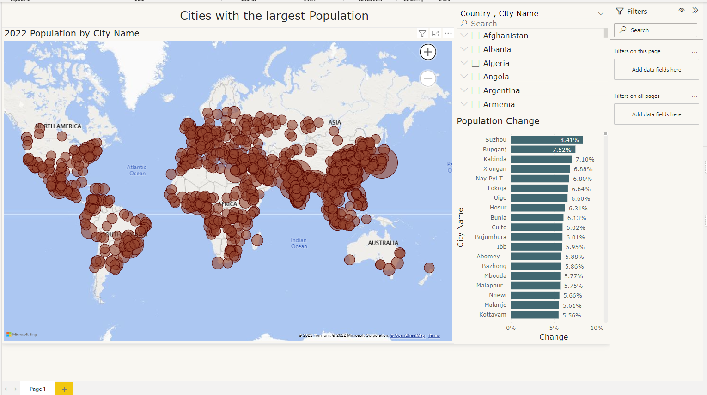

# Web Scraping Project on the largest cities in the world

### Summary: I scraped a table from a website. The data was on the world's largest cities in terms of population. Then I saved the data into a csv file. Using the csv file, I made a visualization/ dashboard using Microsoft's Power Bi.

#Power BI Dashboard

Source of Data:
https://worldpopulationreview.com/world-cities

# References:

- https://stackoverflow.com/questions/3348460/csv-file-written-with-python-has-blank-lines-between-each-row

- https://www.youtube.com/watch?v=XVv6mJpFOb0